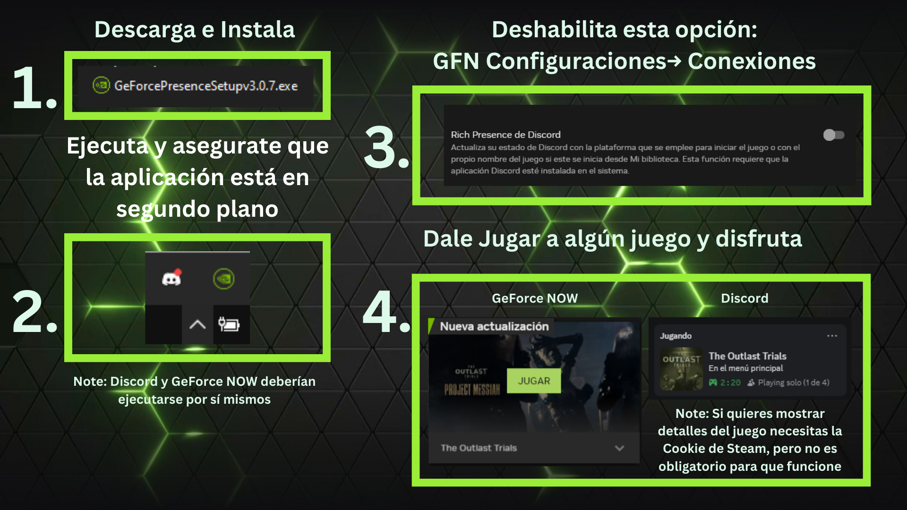

<h1 align="center">🎮 Presencia Enriquecida de GeForce NOW para Discord</h1>

  Muestra el juego que realmente estás jugando en Discord mientras usas <strong>GeForce NOW</strong> — automáticamente y con estilo.
    
  <a href="https://github.com/KarmaDevz/discord-rich-presence-for-geforcenow/releases/latest">
    

   

  

  

---

## 🕹️ ¿Qué es esto?

**Presencia Enriquecida de GeForce NOW para Discord** te permite mostrar el **juego real que estás jugando en GeForce NOW** directamente en tu perfil de Discord.  
Ya no más “Jugando a GeForce NOW” — ahora mostrará el **título real, imagen y estado personalizado** en tiempo real.

Perfecto para streamers, gamers y cualquiera que disfrute mostrar lo que está jugando 🎮💚

---

## ✨ Características

- ✅ **Detección automática** del juego que ejecutas en GeForce NOW  
- ✅ Muestra **nombres e imágenes reales** del juego en Discord  
- ✅ **Icono en la bandeja del sistema** para forzar un juego, abrir GeForce NOW o salir fácilmente  
- ✅ Funciona inmediatamente — **sin Python, sin configuración, sin complicaciones**  
- ✅ Instalador ligero creado con **Inno Setup**  
- ✅ Totalmente compatible con Windows y Discord Desktop

---

## 📦 Instalación

1. Haz clic en el botón de arriba o ve a la [**Última Versión**](https://github.com/KarmaDevz/discord-rich-presence-for-geforcenow/releases/latest).  
2. Descarga el instalador `.exe`.  
3. Ejecuta el instalador y sigue los pasos simples.  
4. Una vez instalado, abre la aplicación — detectará automáticamente tu sesión de GeForce NOW y actualizará tu Presencia Enriquecida de Discord.  
5. ¡Listo! Relájate y deja que tus amigos vean a qué estás jugando 😎  

---

## 🧠 Cómo funciona (explicación simple)

La aplicación se ejecuta silenciosamente en segundo plano y:
- Detecta cuando inicias un juego en **GeForce NOW**  
- Lo compara con una lista interna de juegos  
- Envía la **Presencia Enriquecida** correcta a Discord  
- La actualiza automáticamente mientras el juego esté en ejecución  

Es 100% automática — no necesitas configurar nada.

---

## 🪄 Opciones del icono en la bandeja

Cuando está en ejecución, la aplicación muestra un icono en la bandeja del sistema de Windows (parte inferior derecha).  
Desde ahí puedes:
- 🎮 **Forzar juego** — elegir manualmente qué juego mostrar  
- 🔄 **Reiniciar detección** — refrescar la sesión actual  
- 🚀 **Abrir GeForce NOW**  
- ❌ **Salir de la aplicación**

---

## 📸 Instrucciones

  

---

## 🧩 Preguntas Frecuentes (FAQ)

**P: ¿Necesito Python o alguna dependencia?**  
R: ¡No! Todo está incluido — solo instala y ejecuta.

**P: ¿Funciona con Steam o Epic Games?**  
R: ¡Sí! Detecta los juegos transmitidos mediante GeForce NOW, sin importar la plataforma.

**P: ¿Es seguro?**  
R: 100%. No se requiere ningún inicio de sesión ni información de cuenta.

---

## 💬 Acerca de

Este proyecto fue creado por [**KarmaDevz**](https://github.com/KarmaDevz) para hacer que la integración entre **GeForce NOW + Discord** sea lo más fluida y automática posible.  
Si te gusta, considera darle una ⭐ al repositorio en GitHub.

---

  

